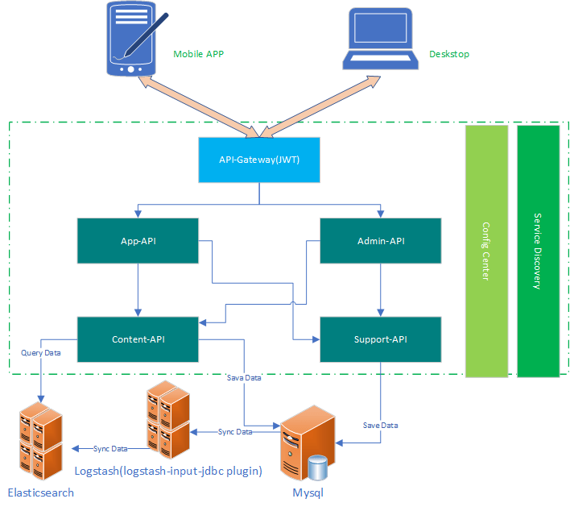
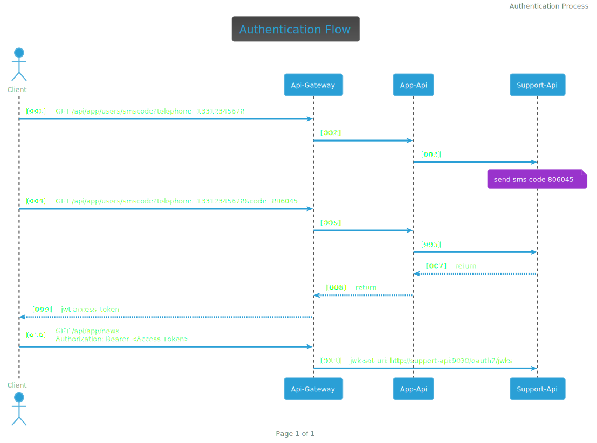

<!-- TABLE OF CONTENTS -->
## Table of Contents
* [Getting Started](#getting-started)
  * [Prerequisites](#prerequisites)
  * [Installation](#installation)
* [Document](#document)    
  * [API Doc](#api-doc)
  * [Database Script](#database-script)
  * [Coverage Report](#coverage-report)
* [Architecture](#architecture)  
  * [Modules](#modules)
  * [Authentication](#authentication)
## Getting Started
### Prerequisites
* docker-compose
* docker-logstash-input-jdbc
1. Clone docker-logstash-input-jdbc repo
```sh
git clone https://github.com/pengliaoye/docker-logstash-input-jdbc.git
```
2. Starting logstash input jdbc
```sh
docker-compose -f compose/mysql/docker-compose.mysql-5.7.yaml -p prj up
--build
```
### Installation
1. Clone the repo
```sh
git clone https://github.com/pengliaoye/achilles.git
```
2. Building from Source
```sh
mvn -pl '!report' spring-boot:build-image
```
3. start project
```sh
docker-compose up
```
4. stop project
```sh
docker-compose down --rmi local
```

## Document
```sh
mvn verify
```
### API Doc
1. achilles-admin\target\generated-docs\index.html
2. achilles-app\target\generated-docs\index.html

### Database Script
* achilles-content\src\main\resources\db\migration\V1.0__init.sql

### Coverage Report
* report/target/site/jacoco-aggregate/index.html

## Architecture

### Modules
| module name | port | description |
| :-----| ----: | :----: |
| discovery | 8761 | Service Discovery |
| configserver | 8888 | Config Center |
|api-gateway|9090|API Gateway|
|app-api|9010|App Api|
|admin-api|9020|Admin Api|
|support-api|9030|Support Api|
|content-api|9040|Content Api|
### Authentication
